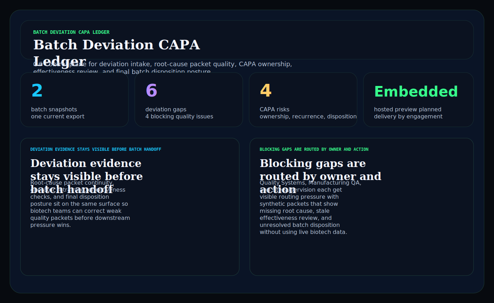
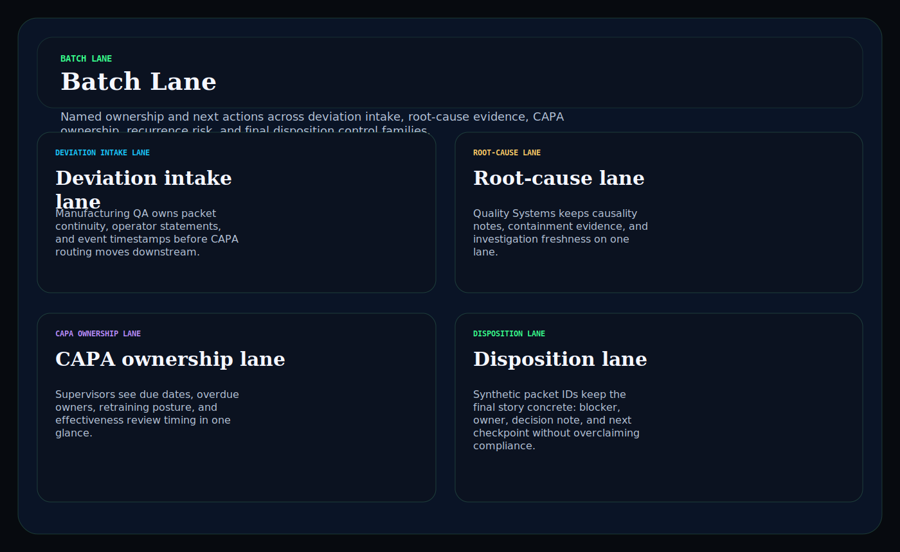
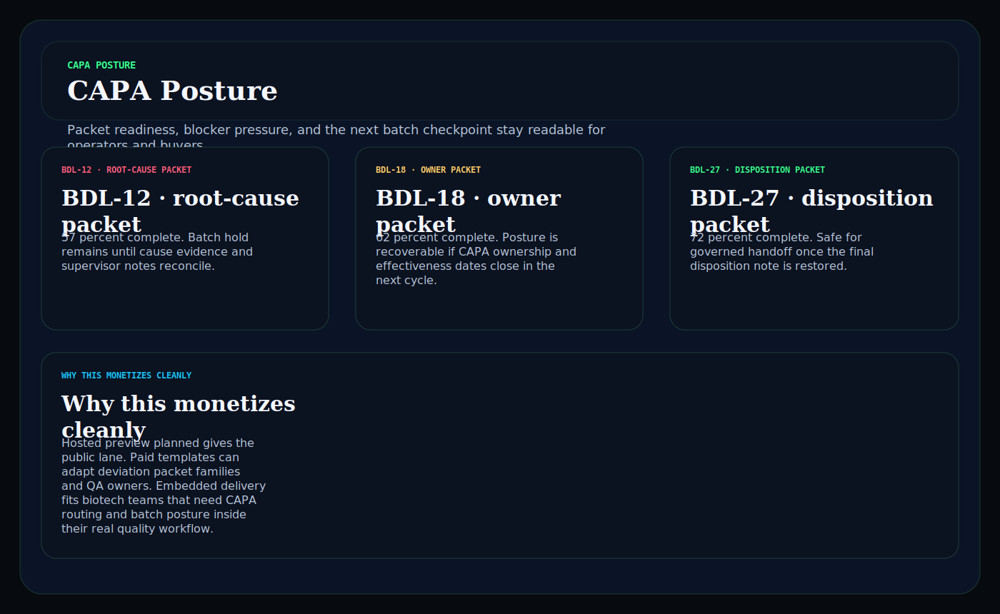

# batch-deviation-capa-ledger

Biotech / diagnostics operator surface in C# for keeping batch deviations, root-cause packets, CAPA ownership, effectiveness checks, and final disposition posture in one readable control plane.

## Why this matters

Biotech quality teams do not need another vague compliance landing page. They need a board that keeps deviation evidence, CAPA ownership, recurrence pressure, retraining status, and final batch disposition visible together before weak packets escape into the next release cycle.

This repo is the public proof surface for that pattern:

- `Hosted preview planned` for a browser-based deviation and CAPA control plane
- `Embedded by engagement` for teams that need the routing model inside a regulated biotech quality workflow

## What it includes

- ASP.NET Core minimal API in C#
- synthetic batch snapshots, deviation gaps, and CAPA packets
- operator surfaces for:
  - `/batch-lane`
  - `/deviation-findings`
  - `/capa-posture`
  - `/verification`
  - `/docs`
- structured JSON endpoints under `/api/*`
- static Pages export with `robots.txt`, `sitemap.xml`, and `CNAME`

## Screenshots





## Verification

- synthetic biotech quality evidence only
- no patient, clinician, or proprietary biotech secrets
- no claim of CLIA, GxP, FDA, or clinical compliance
- this is a control-plane proof surface for workflow depth, not a compliance certification claim

## Local run

```powershell
dotnet test
dotnet run --project src/BatchDeviationCapaLedger.Api -- --demo
dotnet run --project src/BatchDeviationCapaLedger.Api
```

Then open:

- `http://127.0.0.1:5088/`
- `http://127.0.0.1:5088/batch-lane`
- `http://127.0.0.1:5088/deviation-findings`
- `http://127.0.0.1:5088/capa-posture`

## Render static site

```powershell
dotnet run --project src/BatchDeviationCapaLedger.Api -- --prerender
```

## Related docs

- [Embedded framing](./docs/KINETIC_GAIN_EMBEDDED.md)
- [Origin story](./docs/ORIGIN.md)
